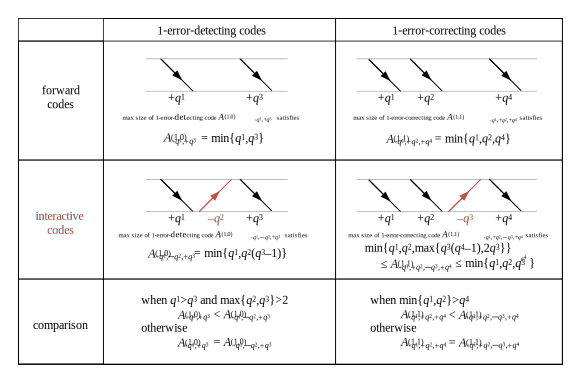

Error Correcting/Detecting Codes
=======================




## Python Package: `errcode`

#### Install

```
pip install --upgrade errcode
```

#### API

```python
errcode.max_size(arity:int|list[int]=2, repeat:int=1, direction:int|list[int]=1, correct:int=0, detect:Optional[int]=None) -> int|range
```

#### Usage Example

```python
from errcode import max_size
print(max_size(arity=2, repeat=6, correct=4))
print(max_size(arity=[5, -3, 4], detect=1))
```

## Published Papers

- Zhiqing Xiao, et. al., “Interactive codes to correct and detect omniscient Byzantine adversary,” 2014. [[abstract]](http://ieeexplore.ieee.org/document/6970789/) [[PDF]](https://zhiqingxiao.github.io/papers/xiao2014interactive.pdf) [[bibtex]](https://zhiqingxiao.github.io/papers/xiao2014interactive.bib)

- Zhiqing Xiao, et. al., “Size of 1-error-correcting codes in three interactive transmissions,” 2015. [[abstract]](http://ieeexplore.ieee.org/document/7146090/) [[PDF]](https://zhiqingxiao.github.io/papers/xiao2015size.pdf) [[bibtex]](https://zhiqingxiao.github.io/papers/xiao2015size.bib)

- Zhiqing Xiao, Fundamental Limits of Network Error Correction (in Chinese), Ph.D. dissertation, 2016. [[PDF]](https://zhiqingxiao.github.io/papers/xiao2016fundamental.pdf)
